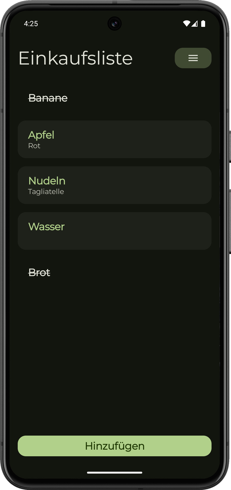
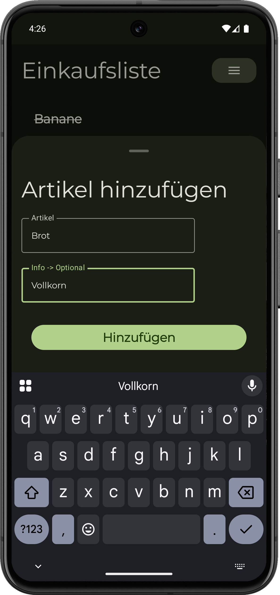

# ShoppingList
A minimalist Android app that lets you organize your shopping.  
Created with Jetpack Compose, Room and Hilt. 

## Features
- Add items to the list
- Check off items when purchased 
- Re-sort items using long press & drag (not implemented yet)
- Persistent storage with Room
- Create and add Recipes (not implemented yet)
- sending items to backend and saving them into DB(example)

## Technologien
- Jetpack Compose
- Room
- MVVM Architektur
- Hilt Dagger
- Retrofit
- okHttp

<table>
    <tr>
    <td><h3 style="text-align: center;">List View</h3></td>
    <td><h3 style="text-align: center;">Add View</h3></td>
    </tr>
    <tr>
    <td></td>
    <td></td>
    </tr>
</table>
